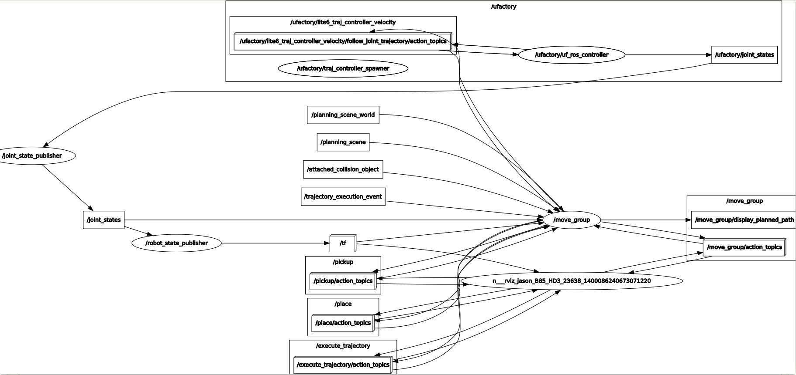

# Important Notice:
This ReadMe is for new(Lite 6) and future UFACTORY product models other than xArm series. Here use "lite6" as example.  

If you have used "xarm_ros" for xArm series before, the main differences for new UFACTROY models are:  

* Default namespace has changed from `xarm` to `ufactory`;  

* Robot full-state report topic name has changed from `xarm_states` to `robot_states`;   


# 1. Simulations

## 1.1 Simple Rviz visualization:  
```bash
$ roslaunch xarm_description lite6_rviz_display.launch
```
The robot model will appear in Rviz window and "joint state publisher" panel can be used to adjust the posture of that robot.  


## 1.2 Load robot model in Gazebo environment:
```bash
$ roslaunch xarm_gazebo lite6_beside_table.launch [add_gripper:=true] [add_vacuum_gripper:=true] 
```
Gazebo will be launched and virtual robot will be mounted on a table, `add_gripper` and `add_vacuum_gripper` are optional arguments. However, only one end tool should be installed.  

## 1.3 Moveit simulation:

### Without Gazebo:
```bash
$ roslaunch lite6_moveit_config demo.launch [add_gripper:=true] [add_vacuum_gripper:=true]
```
### With Gazebo:
In the first terminal, run:
```bash
$ roslaunch xarm_gazebo lite6_beside_table.launch [add_gripper:=true] [add_vacuum_gripper:=true] 
```
Then in another terminal:
```bash
$ roslaunch lite6_moveit_config lite6_moveit_gazebo.launch [add_gripper:=true] [add_vacuum_gripper:=true] 
```
In this way, the simulated robot in gazebo can execute planned trajectory generated by Moveit. 


# 2. Controlling Real Robot

# 2.1 ROS service control:
First bring up the UFACTORY ros driver:
```bash
$ roslaunch xarm_bringup lite6_server.launch robot_ip:=192.168.1.xxx (your robot IP)
```
Then, please refer to [xarm_api/xarm_msgs part](https://github.com/xArm-Developer/xarm_ros#57-xarm_apixarm_msgs), the conceptsm provided services or messages are all the same except the **default namespace for non-xArm series** is `ufactory` rather than `xarm`. For example, to call the service of enabling all joints:
```bash
$ rosservice call /ufactory/motion_ctrl 8 1
```
All the xArm services (joint/cartesian motion, velocity motion, servo motions, etc) including [mode operations](https://github.com/xArm-Developer/xarm_ros#6-mode-change) can be directly used on new models like Lite 6, just replace previous namespace `/xarm` with `/ufactory`. 

# 2.2 Moveit control:
First make sure the robot and controller box are powered on, then execute:
```bash
$ roslaunch lite6_moveit_config realMove_exec.launch robot_ip:=192.168.1.xxx [add_gripper:=true] [add_vacuum_gripper:=true]
```
`add_gripper` and `add_vacuum_gripper` are optional available arguments if you have installed UFACTORY provided tool accessory. Only one end tool shall be installed. Below is the network diagram from `rqt_graph` output:
 